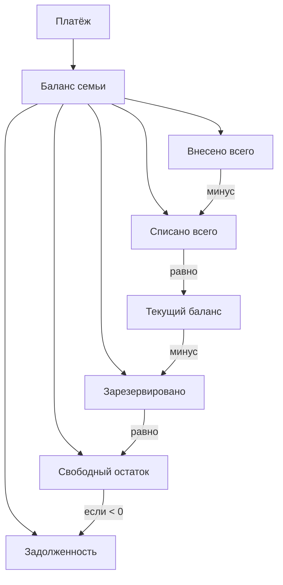
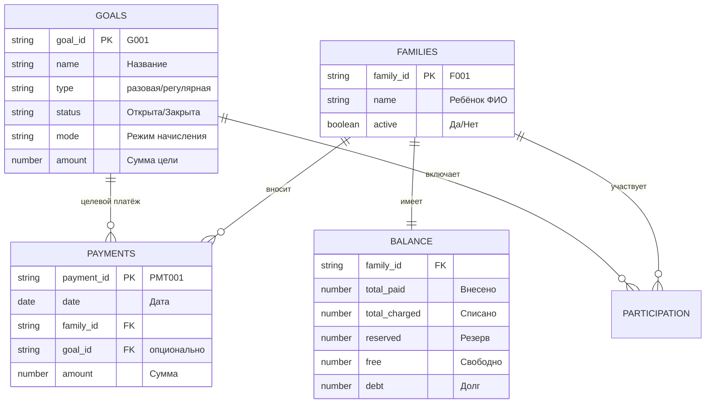
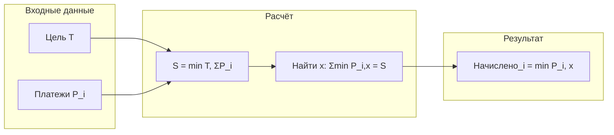
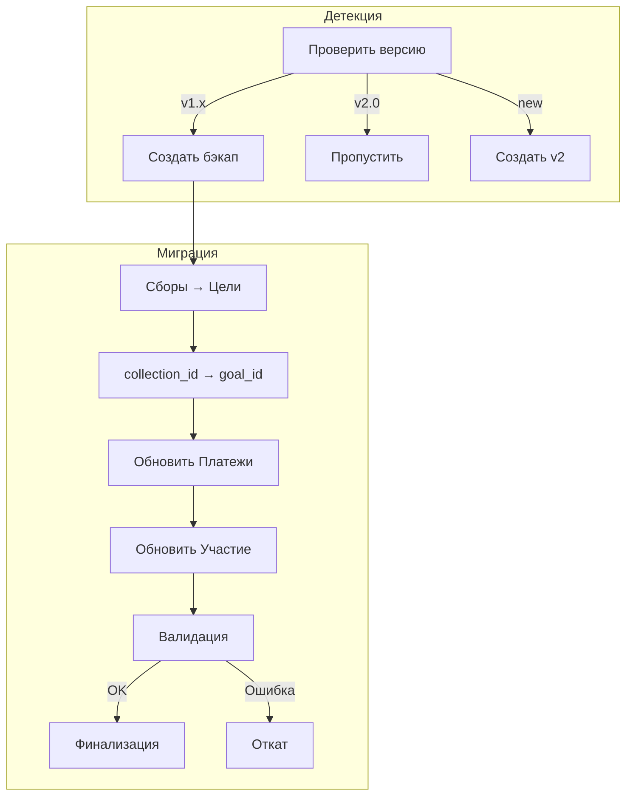
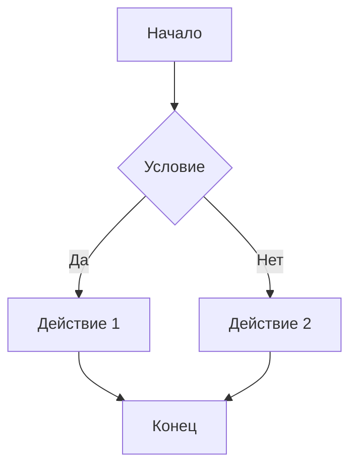

# Copilot Instructions

Эти инструкции направляют GitHub Copilot и Copilot Chat при работе с этим репозиторием Google Apps Script (Google Sheets).

---

## Контекст проекта

- **Тип**: Google Apps Script (V8) для учёта платежей в Google Sheets
- **Основной файл**: `Code.gs`
- **Версия**: 0.2 (текущая) → 2.0 (в разработке)
- **Главные API**: `SpreadsheetApp`, `PropertiesService`, `Utilities`, `Logger`, `UrlFetchApp`
- **Цель**: надёжная и быстрая обработка данных таблиц, минимизируя обращения к API Sheets

### Ключевые документы
- `docs/TZ-v2.md` — техническое задание v2.0 (балансовая модель)
- `docs/MIGRATION-PLAN.md` — план миграции v1 → v2
- `docs/TZ.md` — техническое задание v1.x (legacy)
- `README.md` — руководство пользователя

---

## Версии и архитектура

### Версия 1.x (текущая, legacy)
- Платёж привязан к конкретному сбору (collection_id обязателен)
- Баланс = Оплачено − Начислено

### Версия 2.0 (в разработке)
- **Балансовая модель**: платежи пополняют баланс, цели списывают с баланса
- **Свободные платежи**: goal_id опционален
- **Регулярные цели**: ежемесячные/ежеквартальные с автосозданием
- **Новая структура баланса**:



---

## Домен и спецификация

Продукт: учёт сборов/взносов для класса/группы в Google Sheets.

- 1 семья = 1 ребёнок
- Все расчёты — моментальные по текущим данным (дата платежа — справочная)
- Выпадающие списки показывают метки формата «Название (ID)», для вычислений извлекается ID

### Структура листов (v2.0)



### Модель данных и ID
- `family_id` → F001, F002, …
- `goal_id` → G001, G002, … (v2.0) / `collection_id` → C001, C002, … (v1.x)
- `payment_id` → PMT001, PMT002, …

### Режимы начисления

| Режим | Формула | Описание |
|-------|---------|----------|
| `static_per_family` | `Начислено = T` | Фикс на семью |
| `shared_total_all` | `Начислено = T / N` | Делим на всех участников |
| `shared_total_by_payers` | `Начислено = T / K` | Делим между оплатившими |
| `dynamic_by_payers` | `Начислено = min(P_i, x)` | Water-filling |
| `proportional_by_payers` | `Начислено = P_i × (T/ΣP)` | Пропорционально |
| `unit_price` | `Начислено = floor(P_i/x) × x` | Поштучно |
| `voluntary` | `Начислено = P_i` | Добровольно (v2.0) |

### Алгоритм water-filling (dynamic_by_payers)



### Бизнес-правила участия
- По умолчанию участники — все активные семьи
- Если есть хотя бы один «Участвует» → участники = только указанные
- «Не участвует» всегда исключает семью

---

## Миграция v1 → v2



**Ключевые принципы миграции:**
- Автоматический бэкап перед миграцией
- Возможность отката к v1.x
- Обратная совместимость (алиасы для старых функций)
- Валидация сумм после миграции

---

## Язык и формат ответов

- Комментарии, сообщения об ошибках и пояснения — **на русском**, если не указано иное
- Предлагай завершённые решения без заглушек и «TODO»
- При изменении существующего кода учитывай текущий стиль и не переформатируй несвязанные части

### Диаграммы — только Mermaid

**Все диаграммы должны быть в формате Mermaid** для совместимости с GitHub и VS Code:



Поддерживаемые типы диаграмм:
- `flowchart` / `graph` — блок-схемы, процессы
- `sequenceDiagram` — последовательности вызовов
- `erDiagram` — ER-диаграммы (структура данных)
- `stateDiagram-v2` — диаграммы состояний
- `classDiagram` — UML-классы
- `gantt` — диаграммы Ганта (планирование)

**Не использовать**: ASCII-art диаграммы, PlantUML, draw.io — только Mermaid.

---

## Стиль кода (Apps Script / JS)
- Рантайм: V8. Разрешены `const`/`let`, стрелочные функции, шаблонные строки.
- Именование: `camelCase` для переменных и функций, `UpperCamelCase` для классов, КОНСТАНТЫ_В_ВЕРХНЕМ_РЕГИСТРЕ при необходимости.
- Типы/JSDoc: добавляй JSDoc к публичным функциям и сложным структурам.
- Логирование: используй `Logger.log` умеренно, оставляй понятные сообщения.
- Ошибки: бросай `new Error('…')` с контекстом; перехватывай там, где можно восстановиться или нужно обогатить сообщение.

## Архитектура и разбиение на функции
- Разделяй чистую бизнес-логику и I/O с таблицей:
  - Чистые функции: преобразование данных, валидация, агрегация.
  - I/O-слой: чтение/запись диапазонов, триггеры, конфигурация.
- Не полагайся на глобальное состояние. Для конфигурации используй `PropertiesService` (Script/User) с префиксами ключей.
- Точки входа (для меню/триггеров) — небольшие, вызывают чистые функции.

## Производительность (Sheets best practices)
- Минимизируй количество обращений к API:
  - Читай/записывай массивами: `getValues()`/`setValues()` вместо поячейчной обработки.
  - Работай с диапазонами пакетно; избегай циклов с `getValue()/setValue()`.
- Предварительно фильтруй и подготавливай данные в памяти (массивы/объекты).
- Кэширование: при повторяющихся вычислениях рассматривай `CacheService`/`PropertiesService`.

## Валидация и надёжность
- Проверяй входные данные и схемы строк: пустые значения, типы, форматы дат/сумм.
- Обрабатывай пограничные случаи: пустой лист, дубликаты, несовпадение заголовков, нехватка прав.
- Не хардкоди секреты; для токенов/ключей используй свойства сценария.

## Документация и комментарии
- В начале файла/модуля — краткое описание назначения.
- Для экспортируемых функций — JSDoc с `@param`/`@return` и примерами, где уместно.
- Комментарии — поясняют «почему», а не «что».

## Триггеры и меню
- Если предлагаешь триггер: укажи тип (временной, onEdit/onChange), периодичность и что именно он вызывает.
- Для меню: создавай отдельную функцию инициализации меню (`onOpen`) и маленькие хендлеры.

## Тестируемость
- Стремись к чистым функциям, которые можно проверить через `Logger.log` с маленькими фикстурами.
- Для сложной логики добавляй мини-хелперы для локальной проверки на примерах массивов.

## Коммиты и PR
- Маленькие атомарные изменения с понятными сообщениями (англ. или рус.).
- Описывай эффект и риск; указывай, если есть миграция данных/структуры листа.

## Примеры шаблонов

### Шаблон чтения и записи пачками
```js
/**
 * Возвращает все строки как массив объектов по заголовкам.
 * @param {GoogleAppsScript.Spreadsheet.Sheet} sheet
 * @return {Object<string, any>[]} rows
 */
function readRows(sheet) {
  var range = sheet.getDataRange();
  var values = range.getValues();
  if (values.length < 2) return [];
  var headers = values[0];
  return values.slice(1).map(function(row) {
    var obj = {};
    for (var i = 0; i < headers.length; i++) obj[headers[i]] = row[i];
    return obj;
  });
}

/**
 * Перезаписывает данные из массива объектов по заголовкам.
 * @param {GoogleAppsScript.Spreadsheet.Sheet} sheet
 * @param {Object<string, any>[]} rows
 */
function writeRows(sheet, rows) {
  if (!rows || rows.length === 0) return;
  var headers = Object.keys(rows[0]);
  var values = [headers].concat(rows.map(function(r){
    return headers.map(function(h){ return r[h]; });
  }));
  sheet.clearContents();
  sheet.getRange(1, 1, values.length, headers.length).setValues(values);
}
```

### Шаблон безопасной обработки
```js
function withTry(fn, context) {
  try {
    return fn();
  } catch (e) {
    var msg = '[PaymentSheet] ' + (context || 'op') + ' failed: ' + e.message;
    Logger.log(msg);
    throw new Error(msg);
  }
}
```

### Практические подсказки по реализации домена

1) Извлечение ID из метки «Название (ID)»:
```js
/** Возвращает ID из строки «Название (ID)» или исходное значение, если это уже ID */
function labelToId(value) {
  if (value == null) return '';
  var s = String(value).trim();
  var m = s.match(/\(([^)]+)\)\s*$/);
  return m ? m[1] : s;
}
```

2) Расчёт cap x (water-filling) для dynamic_by_payers:
```js
/**
 * Находит x: sum(min(P_i, x)) = S, где S = min(T, sum(P_i)).
 * p — массив взносов (числа >= 0).
 */
function waterFillingCap(T, p) {
  var payments = p.filter(function(v){ return v > 0; }).sort(function(a,b){ return a-b; });
  if (payments.length === 0) return 0;
  var sumP = payments.reduce(function(a,b){ return a+b; }, 0);
  var S = Math.min(T, sumP);
  if (S <= 0) return 0;
  var n = payments.length;
  var prev = 0;
  for (var i = 0; i < n; i++) {
    var next = payments[i];
    var delta = (next - prev) * (i + 1);
    if (S <= delta) return prev + S / (i + 1);
    S -= delta;
    prev = next;
  }
  return prev + S / n;
}
```

3) Генерация последовательных ID на листах:
```js
function nextId(prefix, index, pad) {
  var width = pad || 3;
  var n = String(index);
  while (n.length < width) n = '0' + n;
  return prefix + n;
}
```

## Как использовать эти инструкции
- Copilot/Chat должен следовать этим правилам при генерации кода и ответов.
- Если правила противоречат текущему коду — предлагай минимальные правки, объясняя компромисс.
- Если чего-то не хватает (структура листа, имена столбцов) — делай 1–2 разумные допущения и продолжай, явно пометив их.

## Как запускать (для пользователей)
1) Открыть пустую Google Таблицу → Расширения → Apps Script → вставить `Code.gs` → сохранить.
2) В таблице: Funds → Setup / Rebuild structure.
3) Заполнить «Семьи», создать «Сборы», при необходимости — «Участие».
4) Вносить «Платежи» через выпадающие «Название (ID)».
5) Смотреть «Баланс». Для динамических — «Close Collection».

## Проверки и приёмочные критерии (сводка)
- Setup создаёт все листы, валидации и инструкцию.
- Generate IDs заполняет пустые ID последовательно (F001, C001, PMT001).
- Участие: показывает только открытые сборы и активные семьи (метки «Название (ID)»).
- Платежи: показывает все семьи/сборы (в т.ч. закрытые); сумма > 0.
- static_per_child: участнику начисляется Параметр суммы; «Не участвует» → 0.
- shared_total_all: начисление = T/N для участвующих; исключённые → 0.
- dynamic_by_payers: до закрытия начислено i = min(P_i, x), Close фиксирует x, после закрытия используется зафиксированный x.
- Баланс: Начислено/Оплачено/Переплата/Задолженность корректны и обновляются мгновенно; даты платежей не влияют на суммы.

---
Коротко: предлагай эффективный, пакетный I/O для Sheets, чистые функции для логики, валидацию входов и понятные комментарии на русском.
