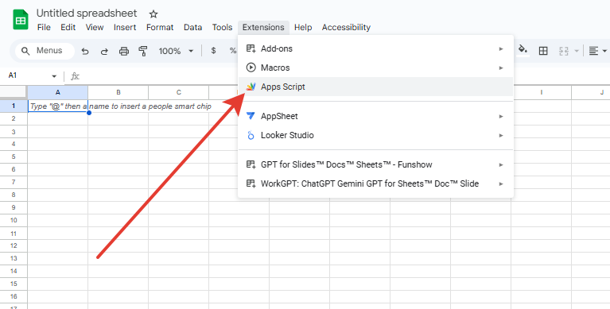
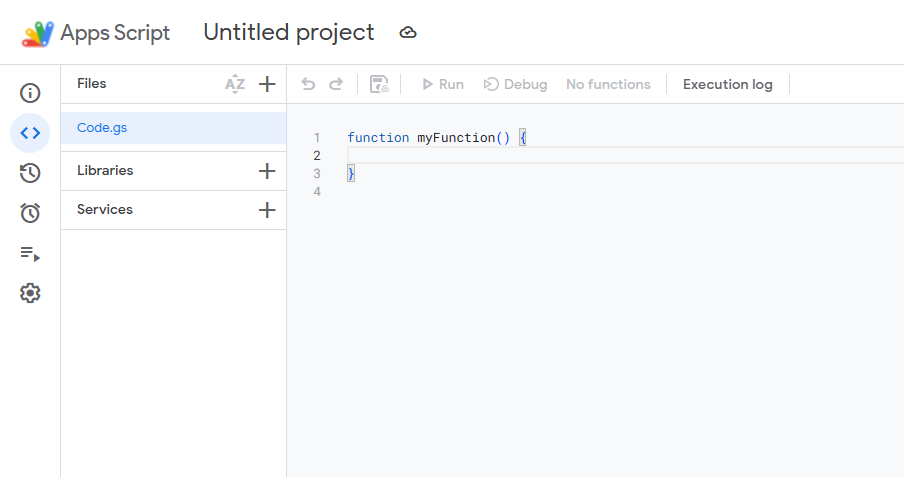
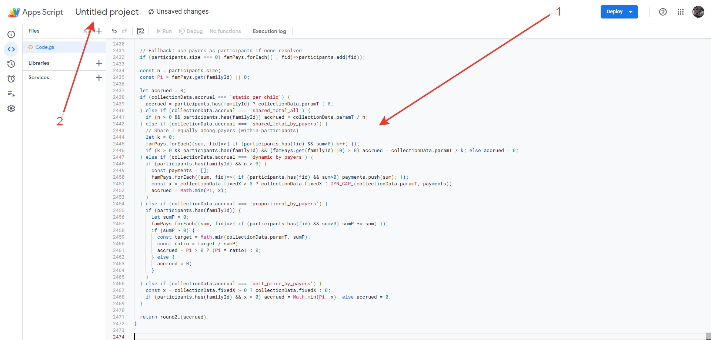
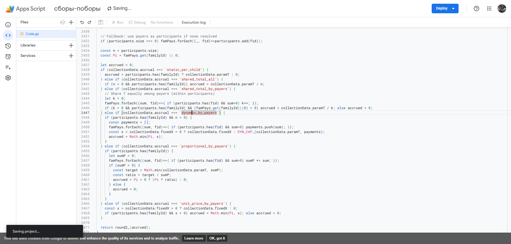
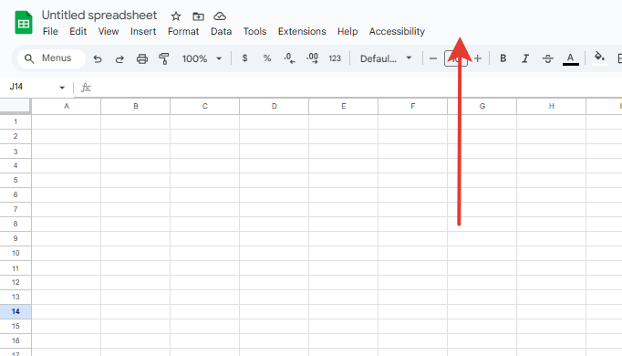
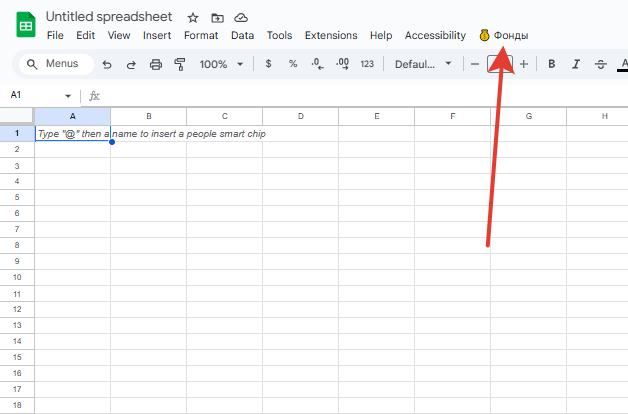
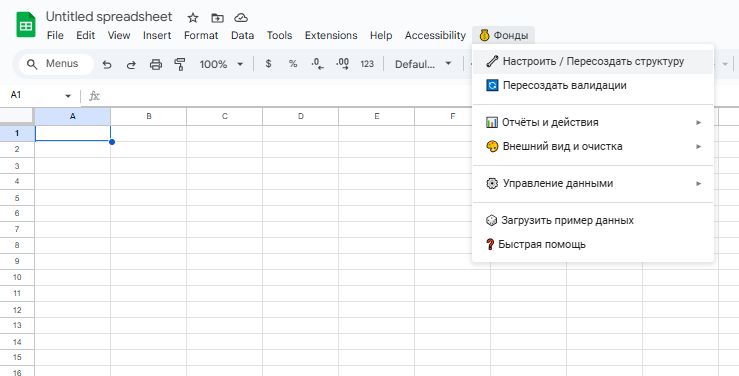

# Учёт сборов/взносов в Google Sheets (Google Apps Script)

Версия: 0.2

Простой и быстрый учёт платежей для класса/группы прямо в Google Таблицах. Одна семья = один ребёнок. Сборы задаются целиком (без «статей»). Все расчёты моментальные и зависят только от текущих данных листов.

## Что умеет
- Структура листов: Инструкция, Семьи, Сборы, Участие, Платежи, Баланс, Детализация, Сводка, Lists (скрытый)
- Выпадающие списки с метками «Название (ID)», логика автоматически извлекает ID
- Режимы начисления:
  - static_per_child — фикс на семью
  - shared_total_all — общая сумма T делится на N участников
  - shared_total_by_payers — общая сумма T делится поровну между оплатившими участниками (K плативших)
  - dynamic_by_payers — цель T распределяется среди плативших через cap x (water-filling): Σ min(P_i, x) = min(T, ΣP_i)
  - proportional_by_payers — цель T распределяется пропорционально взносам плативших: начисление i = T · P_i / ΣP
  - unit_price_by_payers — начисление ограничено «ценой единицы» x (берётся из «Фиксированный x»): начисление i = min(P_i, x)
- Участие: по умолчанию все активные семьи; «Участвует» сужает, «Не участвует» исключает
- Баланс с селектором OPEN/ALL, «Оплачено всего», «Начислено всего», «Переплата (текущая)», «Задолженность`
- Детализация: пометка по каждой паре семья↔сбор (оплачено, начислено, разность, режим)
- Сводка: динамическая таблица по сборам (цель, собрано, участники, плательщики, ещё плательщиков до закрытия, остаток)
- Меню Funds: Setup, Rebuild validations, Recalculate (Balance & Detail), Generate IDs, Close Collection, Load Sample Data
- Стайлинг, заметки к заголовкам (hover), валидации, именованные диапазоны

## Быстрый старт
1) Откройте пустую Google Таблицу → Расширения → Apps Script → вставьте содержимое `Code.gs` → сохраните.
2) В таблице: меню Funds → Setup / Rebuild structure.
3) Заполните «Семьи» (Активен=Да). Создайте «Сборы» (Статус=Открыт, режим, сумма, при необходимости — «Ссылка на гуглдиск»).
4) При необходимости настройте «Участие».
5) Вносите «Платежи» через выпадающие «Название (ID)». Сумма > 0.
6) Смотрите «Баланс» и «Детализация». Для динамических сборов используйте Close Collection для фиксации x.
7) Смотрите «Сводка» — оперативные итоги по каждому сбору (цель, собрано, участие, оценка доворота).

### Пошагово с иллюстрациями

1. Открыть Apps Script из таблицы и создать сценарий:

  

2. Вставить код из `Code.gs` в редактор:

  

3. Переименовать файл при необходимости и сохранить проект:

  

4. Убедиться, что проект сохранён (значок «сохранено»):

  

5. Вернуться в таблицу. Перед первым запуском меню может не отображаться до обновления:

  

6. Открыть меню Funds и выполнить Setup / Rebuild structure:

  

7. Ознакомиться с пунктами меню:

  

## Листы и поля
- Семьи: Ребёнок ФИО, День рождения, Мама телеграм, Папа телеграм, контакты родителей, Активен, family_id (авто)
- Сборы: Название, Статус (Открыт/Закрыт), Начисление, Параметр суммы, Фиксированный x, collection_id (авто), Ссылка на гуглдиск (опц.)
- Участие: collection_id (label), family_id (label), Статус, Комментарий
- Платежи: Дата (справочно), family_id (label), collection_id (label), Сумма (>0), Способ, Комментарий, payment_id (авто)
- Баланс: family_id, Имя ребёнка, Переплата (текущая), Оплачено всего, Начислено всего, Задолженность; селектор I1: OPEN/ALL
- Детализация: family_id, Имя ребёнка, collection_id, Название сбора, Оплачено, Начислено, Разность (±), Режим; селектор K1: OPEN/ALL
- Сводка: collection_id, Название, Режим, Сумма цели, Собрано, Участников, Плательщиков, Ещё плательщиков до закрытия, Остаток до цели; селектор K1: OPEN/ALL

Скрытый лист Lists формирует именованные диапазоны для валидаций:
- OPEN_COLLECTIONS_LABELS — открытые сборы «Название (ID)»
- COLLECTIONS_LABELS — все сборы
- ACTIVE_FAMILIES_LABELS — активные семьи «Имя (ID)»
- FAMILIES_LABELS — все семьи

## Режимы начисления и подробные примеры
- static_per_child (фикс на семью):
  - Один платит: начисление = ставка всем участникам, независимо от того, кто платил; плативший может иметь переплату.
  - Несколько платят: у всех участников одинаковое начисление = ставка; переплата/недоплата зависит от их платежей.
- shared_total_all (T/N на всех участников):
  - Один платит: начисление = T/N всем участникам; плативший может покрыть больше своей доли (переплата) до оплаты другими.
  - Несколько платят: каждому начислено одинаково = T/N; переплаты у ранних плательщиков до добора остальных.
- shared_total_by_payers (T/K только для оплативших):
  - Один платит: K=1 → начисление этому плательщику = T/1 = T; у него будет недоплата, если внёс < T.
  - Несколько платят: начисление каждой платившей семье = T/K; не платившие получают 0.
- dynamic_by_payers (water‑filling):
  - Один платит: x = min(T, P1) → начисление = min(P1, x) = P1, недоплаты нет (пока один платящий).
  - Несколько платят: находится x такое, что Σ min(P_i, x) = min(T, ΣP_i); начисление семье i = min(P_i, x). После закрытия используется «Фиксированный x».

- proportional_by_payers (пропорционально платившим):
  - Один платит: начисление = T (целиком этому плательщику), если он единственный плативший; у него будет недоплата, если внёс < T.
  - Несколько платят: начисление семье i = T · P_i / ΣP только среди плативших; не платившие получают 0.

- unit_price_by_payers (цена единицы — Фиксированный x):
  - Один платит: начисление = min(P1, x). Если P1 ≥ x, долг не образуется в рамках этого сбора для него; закупка считается за единицами по x.
  - Несколько платят: начисление семье i = min(P_i, x). В «Сводке» оценка «Участников» = ceil(T/x), «Ещё плательщиков до закрытия» ≈ ceil(остаток/x).

## Пересчёт Баланса, Детализации и Сводки
- После изменения режима/параметров начисления или массовых правок «Участие»/«Платежи» используйте Funds → Recalculate (Balance & Detail) — он обновляет также «Сводка».
- Баланс авто‑обновляется при правках на «Платежи», «Семьи», «Сборы». «Детализация» и «Сводка» пересчитываются автоматически (через тик) или через Recalculate.

## Формулы и функции
- LABEL_TO_ID(value) — извлекает ID из «Название (ID)» или возвращает исходное, если это уже ID
- PAYED_TOTAL_FAMILY(family) — сумма всех платежей семьи
- ACCRUED_FAMILY(family, statusFilter) — начислено семье по режимам и участию; statusFilter: OPEN или ALL
- DYN_CAP(T, payments_range) — cap x по water-filling
- Дополнительно: ACCRUED_BREAKDOWN, DEBUG_COLLECTION_ACCRUAL, DEBUG_BALANCE_ACCRUAL, TEST_DYN_CAP

## Закрытие динамического сбора
Funds → Close Collection → введите collection_id (например, C003). Скрипт посчитает x по фактическим платежам участников, запишет «Фиксированный x» и поставит Статус=Закрыт.

## Производительность
- Всё чтение/запись пакетно; формулы «Баланс» ограничены фактическим числом семей
- «Детализация» генерируется одной функцией из батч‑данных, чтобы избежать таймаутов
- Авто‑рефреш «Баланс» и «Детализация» только на значимые правки

## Подсказки
- Если выпадающие пустые — Funds → Rebuild data validations
- Если «Начислено» неожиданно 0 — проверьте лист «Участие» и «Активен» в «Семьи»
- Если что-то «сломалось» — запустите Setup / Rebuild structure

## Ссылки
- Репозиторий: https://github.com/yobushka/paymentAccountingGoogleSheet

## Disclaimer
- Этот инструмент в версии 0.1 только начинает использоваться для личных целей. Contribution & feedback welcome.
- Следите за обработкой персональных данных: передача ПДн за пределы вашей юрисдикции может быть незаконной. Google (и Google Sheets) — иностранная компания; убедитесь, что вы соблюдаете применимое законодательство и локальные политики.

## Лицензия
Код публикуется как есть для использования внутри вашей таблицы. Внешних библиотек нет; только Google Apps Script API.
