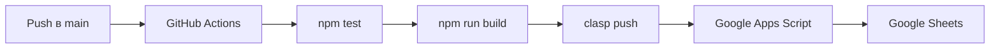

# Зачем

Все просто - задача - вести учет средств получаемых от родителей, serverless, zero-infrastructure и вот это всё...
Клиенты у всех на телефонах есть, учетки гугловые тоже... так что...

# Учёт сборов/взносов в Google Sheets (Google Apps Script)

**Версия: 2.0 (балансовая модель)**

Простой и быстрый учёт платежей для класса/группы прямо в Google Таблицах. Одна семья = один ребёнок. Все расчёты моментальные.

---

## 🚀 Что нового в v2.0

- **Балансовая модель**: платежи пополняют баланс семьи, цели списывают с баланса
- **Свободные платежи**: можно вносить средства без привязки к конкретной цели
- **Регулярные цели**: ежемесячные/ежеквартальные сборы с автосозданием
- **Новая структура баланса**: Внесено → Списано → Резерв → Свободно → Долг
- **Режим voluntary**: добровольные взносы без начисления долга
- **Терминология**: `collection_id` → `goal_id`, «Сборы» → «Цели»
- **Модульная архитектура**: код разбит на 23 модуля в `src/`

Подробности: [docs/TZ-v2.md](docs/TZ-v2.md) | План миграции: [docs/MIGRATION-PLAN.md](docs/MIGRATION-PLAN.md)

### Миграция с v1.x
Для существующих таблиц: **Funds → Migrate to v2.0**. Автоматически:
- Создаётся бэкап
- «Сборы» переименовывается в «Цели»
- `collection_id` → `goal_id` (C001 → G001)
- Обновляются заголовки и формулы

---

## Текущая версия 2.0

### Три базовых листа = 90% успеха
- **Семьи** — справочник семей/контактов и признак «Активен». Именно отсюда берутся участники по умолчанию.
- **Цели** — список всех целей/сборов: тип (разовая/регулярная), режим начисления, сумма/параметры, статус.
- **Платежи** — все входящие платежи с выбором семьи и цели по метке «Название (ID)»; сумма > 0. Цель опциональна (свободный платёж).

Все остальные листы вспомогательные и собираются автоматически из этих трёх: «Баланс», «Детализация», «Сводка», «Lists» (скрытый), «Инструкция», «Выдача» (журнал вручений), «Статус выдачи» (дашборд). Лист «Участие» — опциональный фильтр участия (см. ниже); если он пуст, участвуют все активные семьи.

## Что умеет
- Структура листов: Инструкция, Семьи, Цели, Участие, Платежи, Баланс, Детализация, Сводка, Выдача, Статус выдачи, Lists (скрытый)
- Выпадающие списки с метками «Название (ID)», логика автоматически извлекает ID
- **7 режимов начисления:**
  - `static_per_family` — фикс на семью
  - `shared_total_all` — общая сумма T делится на N участников
  - `shared_total_by_payers` — общая сумма T делится поровну между оплатившими участниками (K плативших)
  - `dynamic_by_payers` — цель T распределяется среди плативших через cap x (water-filling): Σ min(P_i, x) = min(T, ΣP_i)
  - `proportional_by_payers` — цель T распределяется пропорционально взносам плативших: начисление i = T · P_i / ΣP
  - `unit_price` — поштучная покупка по цене x (из «Фиксированный x»): начисление i = floor(P_i/x)·x (полные единицы)
  - `voluntary` — добровольный взнос: списывается ровно столько, сколько внесено (без долга)
- Участие: по умолчанию все активные семьи; «Участвует» сужает, «Не участвует» исключает
- **Баланс v2.0**: Внесено всего, Списано всего, Зарезервировано, Свободный остаток, Задолженность
- Детализация: пометка по каждой паре семья↔цель (оплачено, начислено, разность, режим)
- Сводка: динамическая таблица по целям (сумма, собрано, участники, плательщики, ещё плательщиков до закрытия, остаток)
- Меню Funds: Setup, Rebuild validations, Recalculate (Balance & Detail), Generate IDs, Close Goal, Load Sample Data, Migrate to v2.0
- Стайлинг, заметки к заголовкам (hover), валидации, именованные диапазоны

## Быстрый старт
1) Откройте пустую Google Таблицу → Расширения → Apps Script → вставьте содержимое `Code.gs` → сохраните.
2) В таблице: меню Funds → Setup / Rebuild structure.
3) Заполните «Семьи» (Активен=Да). Создайте «Цели» (Статус=Открыта, режим, сумма, при необходимости — «Ссылка на гуглдиск»).
4) При необходимости настройте «Участие».
5) Вносите «Платежи» через выпадающие «Название (ID)». Сумма > 0. Цель опциональна (свободный платёж).
6) Смотрите «Баланс» и «Детализация». Для динамических целей используйте Close Goal для фиксации x.
7) Смотрите «Сводка» — оперативные итоги по каждой цели (сумма, собрано, участие, оценка доворота).

▶ Выдача единиц (опционально, для поштучных сборов)
8) В «Сборы» установите «К выдаче детям» = Да и режим начисления = unit_price_by_payers. Убедитесь, что «Фиксированный x» задан как цена за единицу (> 0).
9) Вносите вручения на листе «Выдача»: укажите дату (справочно), сбор и семью по меткам «Название (ID)», количество «Единиц» (> 0), «Кто выдал» (текст), «Выдано» = Да/Нет.
10) Откройте «Статус выдачи» — он заполняется автоматически: сколько единиц требуется (ceil(T/x)), оплачено (⌊собрано/x⌋), выдано (сумма «Единиц» с Выдано=Да), и остаток к выдаче.

### Порядок заполнения данных
1) **Семьи** — заполните карточки семей. Убедитесь, что у строк появились ID (колонка family_id). Если пусто, используйте Funds → Generate IDs (all sheets).
2) **Цели** — добавьте нужные цели. Выберите тип (разовая/регулярная), режим начисления и заполните суммы/параметры. Статус=Открыта. Для unit_price укажите «Фиксированный x» как цену за единицу.
3) **Платежи** — вносите платежи: выберите семью и цель по выпадающим «Название (ID)», укажите сумму (>0) и способ (СБП/карта/наличные). Цель можно не указывать — это свободный платёж.
4) **Обновление** — выполните Funds → Recalculate (Balance & Detail) и проверьте «Баланс», «Детализация», «Сводка».

### Пошагово с иллюстрациями

1. Открыть Apps Script из таблицы и создать сценарий:

  

2. Вставить код из `Code.gs` в редактор:

  

3. Переименовать файл при необходимости и сохранить проект:

  

4. Убедиться, что проект сохранён (значок «сохранено»):

  

5. Вернуться в таблицу. Перед первым запуском меню может не отображаться до обновления:

  

6. Открыть меню Funds и выполнить Setup / Rebuild structure:

  

7. Ознакомиться с пунктами меню:

  

## Листы и поля
- **Семьи**: Имя ребёнка, День рождения, Мама телеграм, Папа телеграм, контакты родителей, Активен, family_id (авто)
- **Цели (v2.0)**: Название цели, Тип (разовая/регулярная), Статус (Открыта/Закрыта/Отменена), Дата начала, Дедлайн, Начисление, Параметр суммы, Фиксированный x, Периодичность, Родительская цель, К выдаче детям (Да/Нет), Комментарий, goal_id (авто), Ссылка на гуглдиск (опц.)
- **Участие**: goal_id (label), family_id (label), Статус, Комментарий
- **Платежи**: Дата (справочно), family_id (label), goal_id (label) — опционально, Сумма (>0), Способ, Комментарий, payment_id (авто)
- **Баланс (v2.0)**: family_id, Имя ребёнка, Внесено всего, Списано всего, Зарезервировано, Свободный остаток, Задолженность
- **Детализация**: family_id, Имя ребёнка, goal_id, Название цели, Оплачено, Начислено, Разность (±), Режим; селектор K1: OPEN/ALL
- **Сводка**: goal_id, Название, Режим, Сумма цели, Собрано, Участников, Плательщиков, Единиц оплачено, Ещё плательщиков до закрытия, Остаток до цели; селектор K1: OPEN/ALL
- **Выдача** (журнал вручений): Дата выдачи (справочно), goal_id (label), family_id (label), Единиц (>0), Кто выдал, Выдано (Да/Нет), Комментарий
- **Статус выдачи** (дашборд): goal_id, Название, Статус, x (цена), Единиц требуется, Единиц оплачено, Единиц выдано, Остаток (шт)

Скрытый лист Lists формирует именованные диапазоны для валидаций:
- `OPEN_GOALS_LABELS` — открытые цели «Название (ID)»
- `GOALS_LABELS` — все цели
- `ACTIVE_FAMILIES_LABELS` — активные семьи «Имя (ID)»
- `FAMILIES_LABELS` — все семьи

## Если возникли проблемы — быстрое восстановление
- Чаще всего достаточно удалить проблемные листы (например, «Баланс», «Детализация», «Сводка», «Lists», «Инструкция», «Участие») и выполнить Funds → Setup / Rebuild structure — структура и валидации пересоздадутся автоматически.
- Данные на базовых листах «Семьи», «Сборы», «Платежи» сохранятся; они являются источником истины для всех расчётов.
- Лист «Участие» используется системой для явного управления участниками, но он опционален для заполнения. Если его не заполнять — участвуют все активные семьи. Удалять его не обязательно: Setup всё равно пересоздаст лист при восстановлении структуры.

## Режимы начисления и подробные примеры
- static_per_child (фикс на семью):
  - Один платит: начисление = ставка всем участникам, независимо от того, кто платил; плативший может иметь переплату.
  - Несколько платят: у всех участников одинаковое начисление = ставка; переплата/недоплата зависит от их платежей.
- shared_total_all (T/N на всех участников):
  - Один платит: начисление = T/N всем участникам; плативший может покрыть больше своей доли (переплата) до оплаты другими.
  - Несколько платят: каждому начислено одинаково = T/N; переплаты у ранних плательщиков до добора остальных.
- shared_total_by_payers (T/K только для оплативших):
  - Один платит: K=1 → начисление этому плательщику = T/1 = T; у него будет недоплата, если внёс < T.
  - Несколько платят: начисление каждой платившей семье = T/K; не платившие получают 0.
- dynamic_by_payers (water‑filling):
  - Один платит: x = min(T, P1) → начисление = min(P1, x) = P1, недоплаты нет (пока один платящий).
  - Несколько платят: находится x такое, что Σ min(P_i, x) = min(T, ΣP_i); начисление семье i = min(P_i, x). После закрытия используется «Фиксированный x».

- proportional_by_payers (пропорционально платившим):
  - Один платит: начисление = T (целиком этому плательщику), если он единственный плативший; у него будет недоплата, если внёс < T.
  - Несколько платят: начисление семье i = T · P_i / ΣP только среди плативших; не платившие получают 0.

- unit_price_by_payers (цена единицы — Фиксированный x):
  - Один платит: начисление = min(P1, x). Если P1 ≥ x, долг не образуется в рамках этого сбора для него; закупка считается за единицами по x.
  - Несколько платят: начисление семье i = floor(P_i/x)·x (только полные единицы). В «Сводке»: «Участников» = ceil(T/x), «Плательщиков» = ⌊Собрано/x⌋ (оплаченные единицы), «Ещё плательщиков» ≈ ceil(остаток/x).

### Выдача единиц: как это работает
- Включение: только для unit_price_by_payers. В «Сборы» поставьте «К выдаче детям» = Да и задайте «Фиксированный x» как цену за единицу (> 0).
- Журнал «Выдача»: заносите вручения вручную. Валидации: collection_id — из всех сборов (COLLECTIONS_LABELS), family_id — из всех семей (FAMILIES_LABELS), «Единиц» > 0, «Выдано» = Да/Нет.
- Дашборд «Статус выдачи» формируется автоматически и показывает:
  - Единиц требуется = ceil(T/x)
  - Единиц оплачено = ⌊собрано/x⌋ (по платежам)
  - Единиц выдано = сумма «Единиц» с Выдано=Да
  - Остаток (шт) = max(0, Требуется − Выдано)
Примечания: дашборд учитывает только поштучные сборы с валидной ценой x и включённым флагом. Обновляется при изменениях на «Сборы», «Платежи» и «Выдача», а также через Recalculate.

## Сценарии из жизни: что выбрать и почему учёт разный

Ниже — типовые сюжеты из практики с рекомендацией режима, принципом справедливости и коротким числовым примером.

1) static_per_child — «фикс с семьи»
- Когда: одинаковая сумма для каждой семьи независимо от того, платили они или нет. Примеры: «Ежемесячный классный фонд по 500 ₽», «Организационный взнос 300 ₽».
- Почему такой учёт: услуга/польза одинакова для всех участников (каждая семья несёт равную долю), поэтому начисление идёт всем участвующим.
- Как считается: каждому участнику списывается ставка S.
- Пример: 10 семей, S=500 → цель = 10×500=5000. Трое заплатили по 500, остальные позже. У ранних временно переплата, но долгов нет у тех, кто внёс S.

2) shared_total_all — «делим общую сумму на всех участников»
- Когда: известна общая цель T (например, аренда автобуса), и справедливо разделить её между всеми, кто участвует. Примеры: «Поездка T=12 000 ₽ на 8 детей», «Печать фотографий T=6 000 ₽ на класс».
- Почему такой учёт: польза/затраты разделяются равными долями между всеми участниками, независимо от того, кто платил раньше.
- Как считается: доля = T/N, начисляется всем участникам; ранние платежи могут казаться «переплатой», пока не доберут остальные.
- Пример: T=12 000, N=8 → 1500 ₽ каждому. Если семья заплатила 3000, у неё временная переплата 1500.

3) shared_total_by_payers — «делим общую сумму только между платившими»
- Когда: расходы должны нести только те, кто реально внес деньги. Примеры: «Спонтанный подарок от тех, кто скинулся», «Добровольный сбор T=10 000 ₽ на ремонт кабинета без обязаловки».
- Почему такой учёт: принцип добровольности — доля формируется только среди тех, кто участвовал платежом; не платившие не получают начислений/долгов.
- Как считается: доля = T/K, где K — число плательщиков; начисление только плательщикам.
- Пример: T=10 000, платило 4 семьи → по 2500 начислено каждому из этих 4; остальные — 0.

4) dynamic_by_payers — «динамическое выравнивание (cap x, water‑filling)»
- Когда: общая цель T известна, но вносят неравномерно/в разное время, и нужно «выравнивать» ранние переплаты по мере поступлений. Примеры: «Сбор на оборудование T=9000», «Длинный сбор, где идут частичные взносы».
- Почему такой учёт: справедливость через верхнюю границу x для каждого плательщика: начисление i = min(P_i, x). x подбирается так, чтобы Σ min(P_i, x) = min(T, ΣP_i). После закрытия x фиксируется — все видят итоговую равную «планку».
- Как считается: пока сбор открыт — x пересчитывается по фактическим платежам; при закрытии записывается в «Фиксированный x», дальше берётся из него.
- Пример: T=9000, платежи [2000,2000,700,700,700,700,700] → x≈1250; начисления: [1250,1250,700,700,700,700,700].

5) proportional_by_payers — «пропорционально внесённым суммам (без долгов)»
- Когда: это скорее «пожертвования до цели», где никто не должен, но хочется корректно распределить «списание» по взносам. Примеры: «Помощь классу T=8000», «Сбор на подарки кому удобно, без обязаловки».
- Почему такой учёт: кто внёс больше — у того больше «списано», но никогда не больше платежа; не платившие ничего не должны.
- Как считается: берём target = min(T, ΣP); начисление i = P_i × (target/ΣP). При недоборе списывается весь платёж, при переборе — все уменьшаются пропорционально.
- Пример: T=8000, платежи [3000,2000,1500,800,500] (Σ=7800) → списываем 7800 пропорционально долям, долгов не возникает.

6) unit_price_by_payers — «поштучная закупка по цене x»
- Когда: покупаются одинаковые «единицы» с фиксированной ценой (форма, тетради, билеты), и начисление идёт только плательщику, максимум до x. Примеры: «Ученический комплект x=78 ₽ за штуку», «Спортивная форма x=1500 ₽».
- Почему такой учёт: каждая оплаченная единица «закрывает» одну штуку, долг по самому этому сбору не образуется, если внесено ≥ x; не платил — нет списания.
- Как считается: начисление i = floor(P_i/x)·x (только полные единицы), только платившим. В «Сводке»: Участников ≈ ceil(T/x) — сколько штук нужно; Единиц оплачено = ⌊Собрано/x⌋ — сколько штук уже профинансировано; Плательщиков — число уникальных плативших семей.
- Пример: T=780, x=78; платежи 8×78 и несколько частичных → Участников=10, Плательщиков=8, Остаток=156 (2 штуки).

Краткий навигатор выбора режима
- Фикс на всех одинаково? → static_per_child.
- Есть общая цель и участвуют все? → shared_total_all.
- Добровольно: платит кто хочет — делим только среди плативших? → shared_total_by_payers.
- Нужна «честная планка» при неравномерных платежах и потом зафиксировать итог? → dynamic_by_payers.
- Пожертвования без долгов (списывать пропорционально факту) → proportional_by_payers.
- Поштучные покупки с ценой за штуку → unit_price_by_payers.

## Пересчёт Баланса, Детализации и Сводки
- После изменения режима/параметров начисления или массовых правок «Участие»/«Платежи» используйте Funds → Recalculate (Balance & Detail) — он обновляет также «Сводка».
- Баланс авто‑обновляется при правках на «Платежи», «Семьи», «Сборы». «Детализация» и «Сводка» пересчитываются автоматически (через тик) или через Recalculate.

## Формулы и функции
- LABEL_TO_ID(value) — извлекает ID из «Название (ID)» или возвращает исходное, если это уже ID
- PAYED_TOTAL_FAMILY(family) — сумма всех платежей семьи
- ACCRUED_FAMILY(family, statusFilter) — начислено семье по режимам и участию; statusFilter: OPEN или ALL
- DYN_CAP(T, payments_range) — cap x по water-filling
 

## Закрытие динамической цели
Funds → Close Goal → введите goal_id (например, G003). Скрипт посчитает x по фактическим платежам участников, запишет «Фиксированный x» и поставит Статус=Закрыта. Для других режимов «Фиксированный x» не изменяется при закрытии.

## Производительность
- Всё чтение/запись пакетно; формулы «Баланс» ограничены фактическим числом семей
- «Детализация» генерируется одной функцией из батч‑данных, чтобы избежать таймаутов
- Авто‑рефреш «Баланс» и «Детализация» только на значимые правки

## Подсказки
- Если выпадающие пустые — Funds → Rebuild data validations
- Если «Начислено» неожиданно 0 — проверьте лист «Участие» и «Активен» в «Семьи»
- Если что-то «сломалось» — запустите Setup / Rebuild structure

## Ссылки
- Репозиторий: https://github.com/yobushka/paymentAccountingGoogleSheet

---

## 🛠 Разработка

### Модульная архитектура
Код разбит на 23 модуля в папке `src/`:

```
src/
├── config/           # Константы и спецификации листов
│   ├── constants.js  # APP_VERSION, ACCRUAL_MODES, SHEET_NAMES
│   └── sheets-spec.js
├── utils/            # Утилитарные функции
│   └── utils.js
├── calculations/     # Расчёты
│   ├── dyn-cap.js    # DYN_CAP() water-filling
│   ├── custom-functions.js
│   └── recalculate.js
├── sheets/           # Настройка листов
│   ├── balance.js, detail.js, summary.js
│   ├── instruction.js, lists.js
│   └── issue-status.js
├── core/             # Основная логика
│   ├── init.js, validations.js
│   ├── id-generator.js, close-goal.js
│   └── sample-data.js
├── ui/               # Интерфейс
│   ├── menu.js, styles.js
│   └── dialogs.js
├── triggers/         # Обработчики событий
│   └── on-edit.js
└── migration/        # Миграция v1 → v2
    ├── detect-version.js
    └── migrate-v1-to-v2.js
```

### Сборка
```bash
npm run build      # Собрать Code.gs из модулей
npm run validate   # Проверить наличие модулей
```

После сборки `Code.gs` генерируется автоматически. **Не редактируйте его напрямую** — вносите изменения в модули и запускайте `npm run build`.

### Тесты
```bash
npm test           # Запустить тесты (vitest)
```

---

## 🚀 CI/CD: Автодеплой в Google Sheets

Проект настроен для автоматического деплоя в Google Apps Script через GitHub Actions при push в `main`.

### Как это работает



### Настройка CI/CD (пошагово)

#### 1. Установите clasp локально

```bash
npm install -g @google/clasp
```

#### 2. Авторизуйтесь в clasp

```bash
clasp login
```

Откроется браузер для авторизации. После успешной авторизации создастся файл `~/.clasprc.json`.

#### 3. Создайте проект Google Apps Script

**Вариант A: Новый проект**
```bash
# В папке репозитория
clasp create --type sheets --title "Payment Accounting"
```

**Вариант B: Привязка к существующему**
```bash
# Откройте Google Sheets → Расширения → Apps Script
# Скопируйте Script ID из URL: https://script.google.com/d/SCRIPT_ID/edit
clasp clone SCRIPT_ID
```

После этого появится файл `.clasp.json` с вашим `scriptId`.

#### 4. Включите Google Apps Script API

1. Перейдите на [script.google.com/home/usersettings](https://script.google.com/home/usersettings)
2. Включите **Google Apps Script API**

#### 5. Настройте GitHub Secrets

В репозитории GitHub перейдите в **Settings → Secrets and variables → Actions** и добавьте:

| Secret | Описание | Как получить |
|--------|----------|--------------|
| `SCRIPT_ID` | ID вашего Apps Script проекта | Из файла `.clasp.json` или URL проекта |
| `CLASP_CREDENTIALS` | JSON с токенами авторизации | Содержимое файла `~/.clasprc.json` |

**Получение CLASP_CREDENTIALS:**

```bash
cat ~/.clasprc.json
```

Скопируйте весь вывод (это JSON) и вставьте как значение секрета `CLASP_CREDENTIALS`.

> ⚠️ **Важно**: Файл `.clasprc.json` содержит refresh token. Храните его в секрете и не публикуйте!

#### 6. Проверьте настройку

После настройки:
1. Внесите изменение в любой файл в `src/`
2. Сделайте commit и push в `main`
3. Откройте вкладку **Actions** в GitHub — должен запуститься workflow **Deploy to Google Apps Script**
4. После успешного выполнения изменения появятся в Google Apps Script

### Ручной деплой

Если CI/CD не нужен, можно деплоить вручную:

```bash
# Сборка
npm run build

# Деплой
clasp push --force
```

### Локальная разработка с clasp

```bash
# Скачать код из Apps Script
clasp pull

# Загрузить локальные изменения
clasp push

# Открыть редактор Apps Script в браузере
clasp open

# Посмотреть логи
clasp logs
```

### Структура файлов для clasp

```
.
├── .clasp.json        # Конфигурация проекта (scriptId)
├── appsscript.json    # Манифест Apps Script
├── Code.gs            # Собранный код (генерируется)
└── src/               # Исходные модули
```

### Troubleshooting

**Ошибка "Script API not enabled"**
- Включите API: [script.google.com/home/usersettings](https://script.google.com/home/usersettings)

**Ошибка "Invalid Credentials"**
- Перезайдите: `clasp logout && clasp login`
- Обновите секрет `CLASP_CREDENTIALS`

**Ошибка "Script not found"**
- Проверьте `SCRIPT_ID` — он должен совпадать с ID в URL проекта

**Push не работает**
- Убедитесь, что `appsscript.json` существует
- Проверьте права доступа к проекту

---

## Disclaimer
- Этот инструмент в версии 2.0 используется для личных целей. Contribution & feedback welcome.
- Следите за обработкой персональных данных: передача ПДн за пределы вашей юрисдикции может быть незаконной. Google (и Google Sheets) — иностранная компания; убедитесь, что вы соблюдаете применимое законодательство и локальные политики.

## Лицензия
Код публикуется как есть для использования внутри вашей таблицы. Внешних библиотек нет; только Google Apps Script API.
